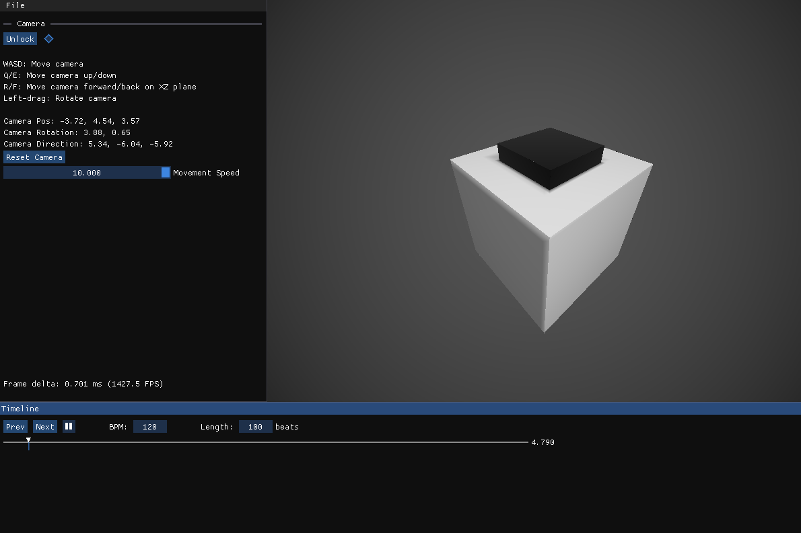
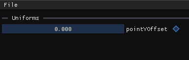
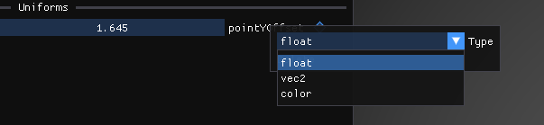
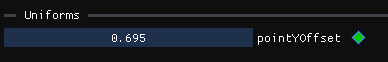
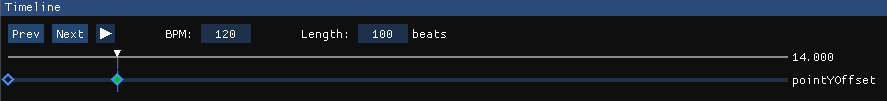
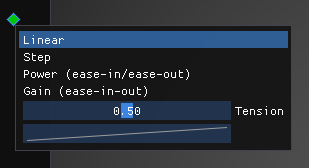
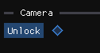

# Installation

Dependencies:

-   Windows
-   Visual Studio 2022
-   Python 3 (for the pre-build script)

To install Benzene:

-   Clone the repository to a local folder.
-   Open `Benzene.vcxproj` in Visual Studio.
-   Set the configuration to `Editor` (instead of `Debug` or `Release`).
-   You're ready to code!

# Creating Our Demo

## First Time

When you first open Benzene, you will see three windows:

-   **The main viewport** - This is where your shader is rendered. It should currently show a cube.
-   **The sidebar** - This is where you will edit your uniform values.
-   **The timeline** - This is where you can seek around the demo.



## Editing Your Shader

The shader is located in `shaders/FragmentShader.glsl`.  
You can edit it with any editor program, like VS Code or Vim.

When you save your shader, Benzene will immediately recognize apply your changes on screen.  
If there are any errors a debug window will pop up letting you know.

## Injecting Uniforms

Uniforms are a useful tool for making your demos.  
They allow you to:

-   Tweak values quickly without writing them down using your mouse
-   Name variables which would be "magic numbers" otherwise
-   Animate values during the demo without extra code

To add a uniform, simply write it in the shader as if it exists.  
For example, let's say we have this code that raises up a point by 10 units:

```glsl
p.y -= 10.;
```

If we want to make the value 10 here into a uniform, we simply change it to some variable name:  
**Note:** _This variable shouldn't be declared in the code_.

```glsl
p.y -= pointYOffset;
```

After changing this line and saving our shader, Benzene will automatically recognize the undefined variable and add a uniform in the sidebar to reflect that.  


### Editing Uniforms

We can now drag this uniform around to change its value, or double-click it to open a text box and type in our desired value.  
There are no size limits - any floating-point number is allowed.

The default uniform is a `float`.  
If we right-click our uniform name, we can change its type to a `vec2` (which we can drag to move around), or a color (which is injected as a `vec3` into our code).  


## Animating

Animating our uniforms is also extremely simple.  
We just seek to some specified time, and click the keyframe button next to our uniform.  
The button will turn green to indicate there's a keyframe at the current position.  
  
The uniform should also appear in our timeline with two keyframes:  


Now we can change the value at the keyframe, and then go back and play to see the animation works.  
Changing the uniform value at a keyframe will edit the keyframe.

### Interpolation

We often don't want our values to move linearly between two keyframes.  
To change that, we can change the _interpolation_.  
If we right-click the keyframe, we'll see the interpolation menu pop up:  
  
There are four interpolation options:

-   **Linear**: Move linearly from the previous keyframe to the next.  
    This is the default option.
-   **Step**: Don't move the value at all until the next keyframe, then immediately change it.
-   **Power**: Move the value while easing in or out.  
    Changing the _Tension_ slider will change the easing direction and strength.  
    The easing function is `x^a` for easing in, and `1-(1-x)^a` for easing out, where `x` is between 0-1 and `a` is a value derived from the tension.
-   **Gain**: Ease both in and out.  
    Changing the tension will change the easing strength.  
    The easing function was copied from [Inigo Quilez's article](https://iquilezles.org/articles/functions/) (called Gain).

**Note:** The interpolation menu controls the interpolation _to_ the selected keyframe (from the previous one).  
The interpolation for the first keyframe does nothing.

## Using the Camera

Benzene supplies a built-in camera uniform for convenient usage in your code.  
The camera position and rotation are also injected as a uniform, the same way everything else is.  
The camera position is injected as a `vec3` called `_cp`, and the camera rotation as `_cr`.  
`_cr` is also a `vec3`, whose components are the pitch, yaw, and roll rotations in radians.

### Moving the Camera

You can control the camera using the mouse and keyboard.

-   **Mouse Drag**: Rotate the camera.
-   **W/S**: Move forward/back.
-   **A/D**: Move right/left.
-   **Q/E**: Move directly up/down (on the Y axis).
-   **R/F**: Move the camera forward and back but only on the XZ plane (i.e. the camera moves flat).

### Animating the Camera - Locked/Unlocked Mode

The camera's keyframe marker is located next to the lock/unlock button.  
  
The camera can be animated like every other uniform, however it also has some special rules.  
The camera can either be **locked** or **unlocked**.

-   If the camera is **locked**, it will follow its animation path.
-   If the camera is **unlocked**, it can be moved around freely, without changing its animation data.  
    This is useful if you want to change something in your scene and be able to look at it without changing your animation.

If you want to edit keyframes for the camera, you can do so while the camera is **locked**, but the camera can only be moved when it's directly on a keyframe.  
If it's not on a keyframe, it won't move and you will see the text "Camera is locked" pop up.  
Moving the camera on a keyframe while **locked** will edit the keyframe.  
You can also add keyframes when the camera is unlocked and they will be set to the camera's position, however you **cannot edit keyframes while the camera is unlocked!**

# Compiling

To compile our code, we have to exit the editor (by closing or using the Esc key).  
The only remaining step is to build the project using either the `Debug` or `Release` configuration in Visual Studio.

-   `Release` - This configuration creates a fully minified, stripped, production-ready executable demo from our code.
-   `Debug` - This creates an executable demo that should run exactly the same as the release version, but with debug symbols included.  
    This is useful for troubleshooting issues with the shader or Benzene if things didn't go smoothly during compilation.

### How It Works

All of our uniforms and keyframes are saved in a file called `config.json`.  
Before building, Visual Studio runs the pre-build Python script located in `scripts/create_release_build.py`, which converts our keyframes into CPP code that interpolates our uniforms and injects them into the shader.  
This interpolating and injecting is saved to an auto-generated file located in `src/generated/release.cpp`, inside a function called `updateUniforms`.  
The release code then calls `updateUniforms` every frame with the current time to animate the demo.

## That's it!

Once you've built the executable, it should be entirely ready.  
You can go ahead and test your entry on any computer you wish.

# Contributing

Benzene is still under development.  
If you want to use it, please submit issues if you run into bugs or problems!  
I'd love to hear from you about feature requests, issues with user experience or any other inconvenience.
